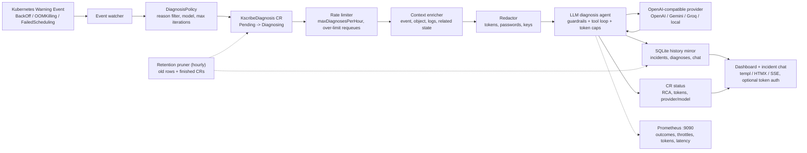

# kscribe

kscribe is a Kubernetes operator that automatically diagnoses Warning events using an LLM and persists RCA results into a SQLite history mirror, surfaced through a live dashboard with incident chat. It ships production guardrails out of the box: retention pruning, Prometheus metrics, optional dashboard auth, and an hourly cap on LLM spend.

---

## How it works



---

## Limitations

**CON-005 — core v1 Events only.** kscribe watches `core/v1 Event` objects (Warning type) exclusively. It does not watch custom events or metrics signals. Pod-log enrichment is available via the tool executor (future wire-in); the MVP uses spec fields from the triggered event.

---

## Security notice — LLM data egress (SEC-003)

kscribe sends enriched, redacted cluster context (event messages, pod metadata, log lines) to the configured LLM provider (default: OpenAI). Sensitive strings matching known patterns (tokens, passwords, PEM keys, connection strings) are scrubbed before transmission (`KSCRIBE_REDACT_ENABLED=true` by default). You remain responsible for reviewing what cluster data leaves your environment. Do not disable redaction in production.

---

## Production configuration

| Knob | Env var | Helm value | Default | Notes |
|------|---------|------------|---------|-------|
| Retention | `KSCRIBE_RETENTION_PERIOD` | `retentionPeriod` | `720h` (30d) | Prunes old incidents/diagnoses/chat rows and finished KscribeDiagnosis CRs hourly. `0` disables. |
| Metrics | `KSCRIBE_METRICS_ADDR` | `metrics.enabled` / `metrics.port` | `:9090` | Prometheus endpoint: `kscribe_diagnoses_total`, `kscribe_diagnoses_throttled_total`, `kscribe_llm_tokens_total`, `kscribe_llm_request_seconds`. `0` disables. |
| Dashboard auth | `KSCRIBE_DASHBOARD_TOKEN` | `dashboard.token` / `dashboard.existingSecret` | off | Static bearer token (`Authorization: Bearer …` or login cookie). Use a high-entropy token (e.g. `openssl rand -hex 32`); failed logins are throttled to 10/min. `/healthz` stays open. |
| LLM cost cap | `KSCRIBE_MAX_DIAGNOSES_PER_HOUR` | `maxDiagnosesPerHour` | `30` | Global cap on diagnosis starts per hour. Over-limit CRs stay `Pending` and retry with jitter — nothing is dropped. `0` = unlimited. |

---

## In-cluster deployment

The Helm chart (`charts/kscribe`) is the single source of truth for the install.
`deploy/kscribe.yaml` is **generated** from it (`scripts/build-manifest.sh`) for
users who prefer plain `kubectl` — do not edit it by hand. See
[docs/manifests.md](docs/manifests.md) for the full pipeline and what to edit where.

### Option A — Helm (recommended)

```sh
helm install kscribe ./charts/kscribe \
  --namespace kscribe-system --create-namespace \
  --set llm.apiKey=<your-openai-api-key>
```

See [charts/kscribe/README.md](charts/kscribe/README.md) for all values
(image, resources, persistence, existing-secret, default policy).

### Option B — plain kubectl

```sh
kubectl apply -f deploy/kscribe.yaml
# the bundle ships an empty kscribe-llm Secret; set your key into it:
kubectl create secret generic kscribe-llm \
  --namespace kscribe-system \
  --from-literal=api-key=<your-openai-api-key> \
  --dry-run=client -o yaml | kubectl apply -f -
```

### Verify

```sh
kubectl rollout status deployment/kscribe -n kscribe-system
kubectl get kscribediagnoses -n kscribe-system
```

The dashboard is available via the `kscribe-dashboard` ClusterIP Service on port 8080 (metrics on 9090 when enabled). Port-forward for local access:

```sh
kubectl port-forward svc/kscribe-dashboard 8080:8080 -n kscribe-system
curl -s localhost:9090/metrics | grep kscribe_   # after: kubectl port-forward ... 9090:9090
```

If `dashboard.token` is set, the browser prompts for the token at `/login` (or send `Authorization: Bearer <token>`); `/healthz` stays open for probes.

Incident detail pages show the diagnosis status, RCA/remediation, redacted context, chat history, and audit metadata including the LLM provider, model, token count, start/completion timestamps, and persistence state.

---

## LLM provider

kscribe talks to any OpenAI-compatible chat-completions API. Configure it with
`KSCRIBE_LLM_PROVIDER` / `KSCRIBE_LLM_MODEL` / `KSCRIBE_LLM_BASE_URL` (or the
chart's `llm.*` values).

| Provider | `llm.provider` | `llm.model` (example) | Base URL |
|----------|----------------|-----------------------|----------|
| OpenAI | `openai` (default) | `gpt-4o-mini` | default |
| Google Gemini | `google` | `gemini-2.0-flash` | auto (Gemini OpenAI endpoint) |
| Z.AI (Zhipu GLM) | `zai` | `glm-4.6` | auto (Z.AI OpenAI endpoint) |
| Groq | `groq` | `llama-3.3-70b-versatile` | auto (Groq OpenAI endpoint) |
| Other (Ollama, vLLM, …) | `openai` | model name | set `llm.baseURL` |

Gemini (uses Google's OpenAI-compatible endpoint — no extra config beyond the key):

```sh
helm upgrade --install kscribe ./charts/kscribe \
  --namespace kscribe-system --create-namespace \
  --set llm.provider=google \
  --set llm.model=gemini-2.0-flash \
  --set llm.apiKey=$GEMINI_API_KEY
```

`llm.baseURL` overrides the endpoint for any other OpenAI-compatible server.

### Runtime safeguards and audit metadata

All LLM requests are scoped by system prompts to Kubernetes incident analysis. The diagnosis prompt tells the model to ignore instructions embedded in cluster context, events, logs, resource names, and tool output. The incident chat prompt applies the same boundary to stored context, RCA text, and chat history; unrelated user requests should receive a short refusal tied to the current incident.

kscribe also caps assistant output tokens on every OpenAI-compatible request:

| Path | Max output tokens |
|------|-------------------|
| Default provider request | 1024 |
| Diagnosis loop turn | 900 |
| Diagnosis JSON repair turn | 500 |
| Incident chat turn | 700 |

Each diagnosis records `llmProvider`, `llmModel`, `tokensUsed`, `startedAt`, and `completedAt` in CR status and mirrors them into SQLite for the dashboard.

### Local end-to-end smoke test

`scripts/local-test.sh` runs the whole loop on a local cluster (minikube or
colima/k3s): build → load image → `helm install` → fire failing pods → wait for
diagnoses → print RCAs → clean up.

```sh
# defaults target LM Studio at http://192.168.100.37:1234/v1
LLM_BASE_URL=http://<host>:1234/v1 LLM_MODEL=openai/gpt-oss-20b scripts/local-test.sh

KEEP=1 scripts/local-test.sh        # leave it running afterwards
SKIP_BUILD=1 scripts/local-test.sh  # reuse the image already in the cluster
UNINSTALL=1 scripts/local-test.sh   # helm uninstall at the end
```

---

## Custom Resource examples

### DiagnosisPolicy — namespace-scoped policy override

```yaml
apiVersion: kscribe.amjadjibon.dev/v1alpha1
kind: DiagnosisPolicy
metadata:
  name: my-policy
  namespace: my-app-namespace
spec:
  enabled: true
  eventReasons:
  - BackOff
  - OOMKilling
  llmProvider: openai
  llmModel: gpt-4o-mini
  maxIterations: 3
  redact: true
```

A `default` DiagnosisPolicy is automatically installed in `kscribe-system` and acts as the cluster-wide fallback when no namespace-scoped policy exists.

### KscribeDiagnosis — auto-created by the operator

KscribeDiagnosis CRs are created automatically from Warning events. You should not create them manually. Example of what the operator produces:

```yaml
apiVersion: kscribe.amjadjibon.dev/v1alpha1
kind: KscribeDiagnosis
metadata:
  name: ksd-<event-uid>
  namespace: kscribe-system
spec:
  involvedObjectKind: Pod
  involvedObjectName: my-pod
  involvedObjectNamespace: default
  reason: BackOff
  message: "Back-off restarting failed container"
  eventUID: "abc123"
status:
  phase: Done
  summary: "Container exits due to missing config mount"
  rootCause: "ConfigMap 'app-config' not found in namespace 'default'"
```

---

## Local development

```sh
# Build binary
make build

# Run all tests
make test

# Run go vet
make vet

# Regenerate deep-copy objects
make generate

# Regenerate CRD and RBAC manifests
make manifests

# Regenerate templ templates
make templ

# Rebuild deploy/kscribe.yaml and assert reproducibility
make manifest-check
```

Run locally against a cluster (requires KUBECONFIG or in-cluster config):

```sh
go run ./cmd/kscribe \
  --addr :8080 \
  --operator-namespace kscribe-system
```

Set `KSCRIBE_LLM_API_KEY` in your environment for LLM calls.

Run the dashboard without Kubernetes using fixture data and a fake streaming provider:

```sh
go run ./cmd/kscribe-web-dev
```

Then open `http://127.0.0.1:18080`.

---

## Upgrades & migrations

Migrations run automatically at operator startup. **They fail closed (ADR-004):** if any migration cannot be applied cleanly, the process exits with an error rather than starting with a partially upgraded schema.

### Operational rollback procedure

1. Before upgrading, take a snapshot of the SQLite PVC (e.g. a VolumeSnapshot or a `cp` to a backup path).
2. Apply the new operator image.
3. If startup fails due to a migration error, restore the PVC snapshot to the pre-upgrade state and roll back the operator image.

The database is a queryable history mirror only — the CR status in the Kubernetes API remains the authoritative source of truth (ADR-003). Restoring the DB snapshot to a previous state does not affect active diagnoses.
