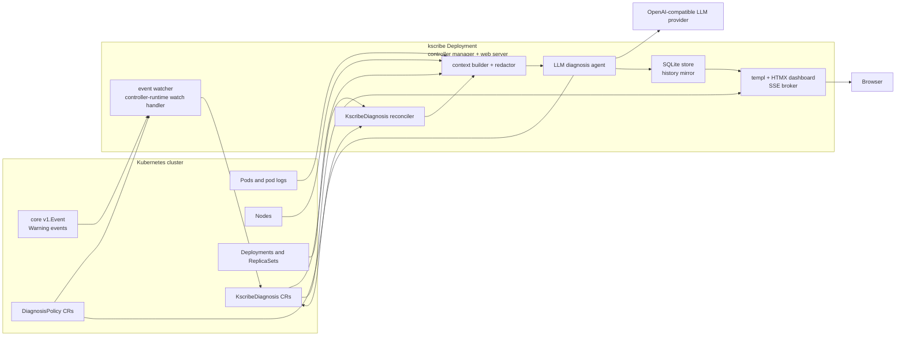
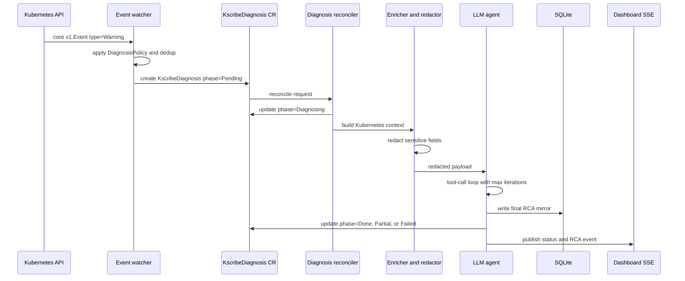
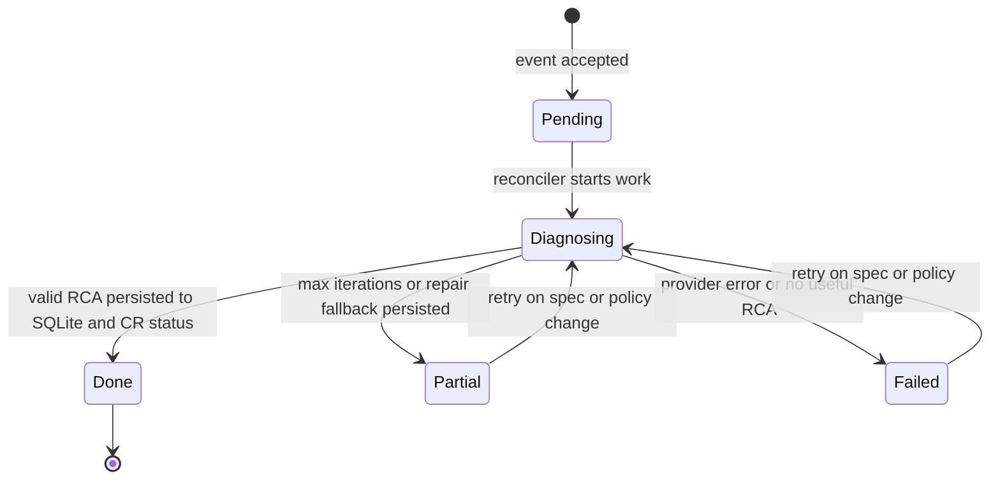

# kscribe Kubernetes Operator MVP


This plan builds `kscribe` as a Kubernetes operator: a single Go controller-manager binary that installs CRDs, watches core Kubernetes `Warning` Events, creates `KscribeDiagnosis` custom resources, reconciles each diagnosis through enrichment and an LLM-assisted RCA loop, persists results in SQLite, and serves a templ + HTMX dashboard. The operator runs as a Kubernetes `Deployment`, while the CRDs and reconcilers define the operator behavior.

The repo currently has no Go implementation files, so the plan starts from scaffold and proceeds through API types, persistence, event ingestion, diagnosis, UI, and deployment.

## 0. Architecture Diagrams

### Runtime Architecture



### Diagnosis Sequence



### Custom Resource Lifecycle



## 1. Requirements & Constraints

- **REQ-001**: The operator must create one deduplicated `KscribeDiagnosis` custom resource for each accepted core `v1.Event` with `type=Warning`.
- **REQ-002**: `KscribeDiagnosis.status.phase` must represent `Pending`, `Diagnosing`, `Done`, `Partial`, and `Failed`.
- **REQ-003**: `DiagnosisPolicy` must provide namespace-level controls for enablement, event reason filters, LLM model/provider overrides, max iterations, and redaction.
- **REQ-004**: The diagnosis reconciler must enrich accepted events with pod logs, related events, node conditions, and deployment/replicaset context when available.
- **REQ-005**: CR status is the source of truth for active diagnoses; SQLite is a queryable history mirror for the dashboard.
- **REQ-006**: Final RCA data must be written to SQLite before the CR phase moves to `Done` or `Partial`.
- **REQ-007**: The dashboard must list diagnoses and stream per-diagnosis status/RCA updates over SSE using templ + HTMX.
- **SEC-001**: Event messages, pod logs, labels, annotations, deployment metadata, and custom-resource payloads must be redacted before any LLM request.
- **SEC-002**: Persisted diagnoses and CR status must record `llmProvider`, `llmModel`, `tokensUsed`, and `promptRedacted`.
- **SEC-003**: Deployment docs must explicitly state that enriched cluster data is sent to the configured LLM provider.
- **CON-001**: Use Cobra for CLI setup and command help.
- **CON-002**: Use `github.com/caarlos0/env/v11` for typed `KSCRIBE_` environment parsing; Cobra flags override env-derived config.
- **CON-003**: Use `github.com/bytedance/sonic` for RCA, tool-call, custom-resource payload, and persisted JSON encode/decode paths; do not use `encoding/json` in application code unless required at a dependency boundary.
- **CON-004**: Use `controller-runtime` and generated CRDs/RBAC via `controller-gen`.
- **CON-005**: MVP supports core `v1.Event` only; `events.k8s.io/v1` support is deferred.
- **CON-006**: MVP runs with `replicas: 1` and SQLite on one PVC; multi-replica database coordination is deferred.
- **CON-007**: Metrics-server tools, Slack notifications, PagerDuty notifications, Helm charts, and CRD conversion webhooks are out of scope.
- **CON-008**: Pin development tools through `tools.go` and `Makefile` targets so agents use the same `controller-gen` and templ commands.

## 2. Architecture Decisions

- **ADR-001 Event watch wiring**: `internal/controller/event_watcher.go` must expose `SetupEventWatcherWithManager(mgr ctrl.Manager, deps EventWatcherDeps) error`. It registers a controller-runtime watch on `corev1.Event` with predicates for `Type == Warning` and an event handler that creates `KscribeDiagnosis` resources. It must not model Events as owned resources and must not depend on Event requeues for diagnosis progress.
- **ADR-002 Policy lookup**: Event acceptance uses the namespace `DiagnosisPolicy` matching the event namespace first, then a `default` policy in the operator namespace, then env config defaults.
- **ADR-003 Status ownership**: CR status is authoritative for active diagnoses. SQLite is updated from reconcile state and final RCA writes. If SQLite write fails before a final phase update, the CR remains `Diagnosing`, gets `Persisted=False`, and is requeued.
- **ADR-004 Migration behavior**: SQLite migrations run in transactions and startup fails closed if a migration fails. A `schema_migrations` table records applied versions. Rollback for MVP is operational: take a PVC snapshot before upgrade and restore it if startup migration fails. README must document this.
- **ADR-005 Manifest assembly**: Generated CRDs/RBAC live under `config/`. `scripts/build-manifest.sh` assembles `deploy/kscribe.yaml` from generated CRDs, RBAC, manager, PVC, Service, and default policy resources. Rerunning the script must produce no diff.

## 3. Implementation Steps

> After completing all tasks in a phase, `git add -u` and commit. No `Co-authored-by:`. Tick `[x]` as each task completes.

### Phase 1: Scaffold CLI, Config, And Tooling

**Goal**: Create the Go project skeleton, runtime command, typed configuration, and pinned tool commands used by every later phase.

- [ ] TASK-001: Create `go.mod` for the `kscribe` module and add initial dependencies for Cobra, caarlos0/env, controller-runtime, Sonic, modernc SQLite, chi, and templ.
- [ ] TASK-002: Create `cmd/kscribe/main.go` with a Cobra root command exposing `--config`, `--leader-elect`, `--addr`, and `--operator-namespace`.
- [ ] TASK-003: Create `internal/config/config.go` with typed config structs parsed from `KSCRIBE_` variables using `github.com/caarlos0/env/v11`.
- [ ] TASK-004: Implement flag-over-env precedence and tests for defaults, required values, durations, slices, env parsing, and flag overrides.
- [ ] TASK-005: Add `tools.go` plus `Makefile` targets for `test`, `generate`, `manifests`, `templ`, and `build`.

**Completion criteria**: `go test ./...`, `go run ./cmd/kscribe --help`, and `make generate` all pass.

**git commit**: `git add -u && git add go.mod go.sum tools.go Makefile cmd internal && git commit -m "feat: scaffold operator CLI"`

**Agent Prompt**:
```text
You are a sub-agent implementing Phase 1 of kscribe-mvp.

Context: kscribe is a new Go Kubernetes operator. This phase creates the module, Cobra CLI, typed environment config, startup logging, and pinned tool commands used by later phases.

Branch: kscribe-mvp/phase-1  |  Base: main

Tasks:
- TASK-001: Create go.mod for the kscribe module and add initial dependencies for Cobra, caarlos0/env, controller-runtime, Sonic, modernc SQLite, chi, and templ.
- TASK-002: Create cmd/kscribe/main.go with a Cobra root command exposing --config, --leader-elect, --addr, and --operator-namespace.
- TASK-003: Create internal/config/config.go with typed config structs parsed from KSCRIBE_ variables using github.com/caarlos0/env/v11.
- TASK-004: Implement flag-over-env precedence and tests for defaults, required values, durations, slices, env parsing, and flag overrides.
- TASK-005: Add tools.go plus Makefile targets for test, generate, manifests, templ, and build.

Key files:
- go.mod - define module and dependencies.
- tools.go - pin generator/tool dependencies.
- Makefile - expose repeatable commands.
- cmd/kscribe/main.go - implement Cobra root command.
- internal/config/config.go - implement typed configuration.
- internal/config/config_test.go - test config behavior.

Completion criteria: go test ./..., go run ./cmd/kscribe --help, and make generate all pass.

When done: git add -u && git add go.mod go.sum tools.go Makefile cmd internal && git commit -m "feat: scaffold operator CLI" - no Co-authored-by
Write a one-paragraph summary of changes and commit SHA.
Do NOT push, open PRs, or modify PLAN.md.
```

---

### Phase 2: Define Operator APIs And Generated Manifests

**Goal**: Add the Kubernetes API surface and generated manifests before controller logic compiles against those types.

**Depends on**: Phase 1 complete

- [ ] TASK-006: Create `api/v1alpha1/groupversion_info.go` with the kscribe API group and scheme registration.
- [ ] TASK-007: Create `api/v1alpha1/kscribediagnosis_types.go` with spec, status, condition, printer-column, short-name, and status-subresource markers.
- [ ] TASK-008: Create `api/v1alpha1/diagnosispolicy_types.go` with policy spec fields and validation markers.
- [ ] TASK-009: Add condition helper functions and tests for `KscribeDiagnosis` status updates.
- [ ] TASK-010: Generate deepcopy code, CRDs, and RBAC into `config/crd/bases` and `config/rbac` using `make generate` and `make manifests`.

**Completion criteria**: `make generate`, `make manifests`, and `go test ./api/...` all pass.

**git commit**: `git add -u && git add api config hack && git commit -m "feat: define operator APIs"`

**Agent Prompt**:
```text
You are a sub-agent implementing Phase 2 of kscribe-mvp.

Context: kscribe is a Go Kubernetes operator. This phase defines its CRDs and generated manifests before reconciliation logic is implemented.

Branch: kscribe-mvp/phase-2  |  Base: kscribe-mvp/phase-1

Tasks:
- TASK-006: Create api/v1alpha1/groupversion_info.go with the kscribe API group and scheme registration.
- TASK-007: Create api/v1alpha1/kscribediagnosis_types.go with spec, status, condition, printer-column, short-name, and status-subresource markers.
- TASK-008: Create api/v1alpha1/diagnosispolicy_types.go with policy spec fields and validation markers.
- TASK-009: Add condition helper functions and tests for KscribeDiagnosis status updates.
- TASK-010: Generate deepcopy code, CRDs, and RBAC into config/crd/bases and config/rbac using make generate and make manifests.

Key files:
- api/v1alpha1/groupversion_info.go - register the API group.
- api/v1alpha1/kscribediagnosis_types.go - define diagnosis CRD.
- api/v1alpha1/diagnosispolicy_types.go - define policy CRD.
- api/v1alpha1/*_test.go - test condition helpers.
- config/crd/bases/*.yaml - generated CRDs.
- config/rbac/*.yaml - generated RBAC.

Completion criteria: make generate, make manifests, and go test ./api/... all pass.

When done: git add -u && git add api config hack && git commit -m "feat: define operator APIs" - no Co-authored-by
Write a one-paragraph summary of changes and commit SHA.
Do NOT push, open PRs, or modify PLAN.md.
```

---

### Phase 3: Implement SQLite Store And Migrations

**Goal**: Build the durable dashboard history store with explicit migration failure behavior before reconcilers depend on it.

**Depends on**: Phase 2 complete

- [ ] TASK-011: Create `migrations/0001_init.sql` with `schema_migrations`, `incidents`, and `diagnoses` tables keyed by CR namespace/name and event UID.
- [ ] TASK-012: Implement `internal/store/migrations.go` to run migrations in transactions and fail startup if any migration fails.
- [ ] TASK-013: Implement `internal/store/sqlite.go` with methods to upsert incident mirrors from CR state, insert final diagnoses, list incidents, and fetch incident details.
- [ ] TASK-014: Add store tests covering migration success, migration failure, status mirror upserts, final diagnosis writes, and read queries.
- [ ] TASK-015: Add README upgrade notes documenting PVC snapshot backup before migrations and restore-on-failure rollback.

**Completion criteria**: `go test ./internal/store` passes and tests prove a failed migration prevents store startup.

**git commit**: `git add -u && git add migrations internal/store README.md && git commit -m "feat: add sqlite diagnosis store"`

**Agent Prompt**:
```text
You are a sub-agent implementing Phase 3 of kscribe-mvp.

Context: kscribe mirrors active CR status and final RCA data into SQLite for dashboard queries. CR status remains the source of truth for active diagnoses.

Branch: kscribe-mvp/phase-3  |  Base: kscribe-mvp/phase-2

Tasks:
- TASK-011: Create migrations/0001_init.sql with schema_migrations, incidents, and diagnoses tables keyed by CR namespace/name and event UID.
- TASK-012: Implement internal/store/migrations.go to run migrations in transactions and fail startup if any migration fails.
- TASK-013: Implement internal/store/sqlite.go with methods to upsert incident mirrors from CR state, insert final diagnoses, list incidents, and fetch incident details.
- TASK-014: Add store tests covering migration success, migration failure, status mirror upserts, final diagnosis writes, and read queries.
- TASK-015: Add README upgrade notes documenting PVC snapshot backup before migrations and restore-on-failure rollback.

Key files:
- migrations/0001_init.sql - define SQLite schema and migration metadata.
- internal/store/migrations.go - run transactional migrations.
- internal/store/sqlite.go - implement persistence methods.
- internal/store/sqlite_test.go - test store behavior.
- README.md - document migration backup and rollback.

Completion criteria: go test ./internal/store passes and tests prove a failed migration prevents store startup.

When done: git add -u && git add migrations internal/store README.md && git commit -m "feat: add sqlite diagnosis store" - no Co-authored-by
Write a one-paragraph summary of changes and commit SHA.
Do NOT push, open PRs, or modify PLAN.md.
```

---

### Phase 4: Implement Event Ingestion And Policy Selection

**Goal**: Convert accepted Kubernetes warning events into deduplicated `KscribeDiagnosis` resources with explicit controller-runtime watch wiring.

**Depends on**: Phase 3 complete

- [ ] TASK-016: Implement `internal/controller/dedup.go` with TTL dedup keyed by event UID when present, then namespace, involved object kind/name, and reason.
- [ ] TASK-017: Implement `internal/controller/diagnosispolicy_controller.go` policy lookup for namespace policy, operator-namespace `default`, then env defaults.
- [ ] TASK-018: Implement `internal/controller/event_watcher.go` with `SetupEventWatcherWithManager(mgr ctrl.Manager, deps EventWatcherDeps) error`.
- [ ] TASK-019: Wire a controller-runtime watch on `corev1.Event` with a `Type == Warning` predicate and an event handler that creates `KscribeDiagnosis`; do not use Event ownership or Event requeues for diagnosis progress.
- [ ] TASK-020: Add fake-client or envtest tests for ignored non-warning events, policy-disabled events, deduped events, and accepted warning events creating exactly one diagnosis CR.

**Completion criteria**: `go test ./internal/controller` passes and tests prove one accepted core `v1.Event` creates one deduplicated `KscribeDiagnosis`.

**git commit**: `git add -u && git add internal/controller && git commit -m "feat: ingest warning events"`

**Agent Prompt**:
```text
You are a sub-agent implementing Phase 4 of kscribe-mvp.

Context: kscribe watches core Kubernetes warning Events and creates KscribeDiagnosis CRs. This phase implements only event ingestion, policy selection, and deduplication.

Branch: kscribe-mvp/phase-4  |  Base: kscribe-mvp/phase-3

Tasks:
- TASK-016: Implement internal/controller/dedup.go with TTL dedup keyed by event UID when present, then namespace, involved object kind/name, and reason.
- TASK-017: Implement internal/controller/diagnosispolicy_controller.go policy lookup for namespace policy, operator-namespace default, then env defaults.
- TASK-018: Implement internal/controller/event_watcher.go with SetupEventWatcherWithManager(mgr ctrl.Manager, deps EventWatcherDeps) error.
- TASK-019: Wire a controller-runtime watch on corev1.Event with a Type == Warning predicate and an event handler that creates KscribeDiagnosis; do not use Event ownership or Event requeues for diagnosis progress.
- TASK-020: Add fake-client or envtest tests for ignored non-warning events, policy-disabled events, deduped events, and accepted warning events creating exactly one diagnosis CR.

Key files:
- internal/controller/dedup.go - implement duplicate suppression.
- internal/controller/diagnosispolicy_controller.go - resolve policies.
- internal/controller/event_watcher.go - wire corev1.Event watch.
- internal/controller/event_watcher_test.go - test event ingestion.

Completion criteria: go test ./internal/controller passes and tests prove one accepted core v1.Event creates one deduplicated KscribeDiagnosis.

When done: git add -u && git add internal/controller && git commit -m "feat: ingest warning events" - no Co-authored-by
Write a one-paragraph summary of changes and commit SHA.
Do NOT push, open PRs, or modify PLAN.md.
```

---

### Phase 5: Implement Enrichment And Redaction

**Goal**: Build the Kubernetes context payload and enforce redaction before any diagnosis agent can call an LLM.

**Depends on**: Phase 4 complete

- [ ] TASK-021: Implement `internal/enricher/context_builder.go` to collect pod logs, related events, node conditions, deployment status, and replicaset context with partial-failure tolerance.
- [ ] TASK-022: Implement `internal/enricher/redactor.go` to redact secret names/values, bearer tokens, API keys, private keys, passwords, connection strings, basic auth URLs, and common sensitive env-var values.
- [ ] TASK-023: Define payload structs and Sonic encode/decode helpers for redacted context snapshots.
- [ ] TASK-024: Add tests for unavailable Kubernetes resources, partial payload output, representative secret redaction, and no `encoding/json` use in enricher application code.

**Completion criteria**: `go test ./internal/enricher` passes and tests prove sensitive samples are redacted before payload serialization.

**git commit**: `git add -u && git add internal/enricher && git commit -m "feat: enrich diagnosis context"`

**Agent Prompt**:
```text
You are a sub-agent implementing Phase 5 of kscribe-mvp.

Context: kscribe diagnoses warning events using Kubernetes context. This phase gathers that context and redacts it before LLM-facing code exists.

Branch: kscribe-mvp/phase-5  |  Base: kscribe-mvp/phase-4

Tasks:
- TASK-021: Implement internal/enricher/context_builder.go to collect pod logs, related events, node conditions, deployment status, and replicaset context with partial-failure tolerance.
- TASK-022: Implement internal/enricher/redactor.go to redact secret names/values, bearer tokens, API keys, private keys, passwords, connection strings, basic auth URLs, and common sensitive env-var values.
- TASK-023: Define payload structs and Sonic encode/decode helpers for redacted context snapshots.
- TASK-024: Add tests for unavailable Kubernetes resources, partial payload output, representative secret redaction, and no encoding/json use in enricher application code.

Key files:
- internal/enricher/context_builder.go - gather Kubernetes context.
- internal/enricher/redactor.go - redact sensitive content.
- internal/enricher/payload.go - define payload structs if needed.
- internal/enricher/*_test.go - test partial context and redaction.

Completion criteria: go test ./internal/enricher passes and tests prove sensitive samples are redacted before payload serialization.

When done: git add -u && git add internal/enricher && git commit -m "feat: enrich diagnosis context" - no Co-authored-by
Write a one-paragraph summary of changes and commit SHA.
Do NOT push, open PRs, or modify PLAN.md.
```

---

### Phase 6: Implement LLM Agent And Diagnosis Reconciler

**Goal**: Reconcile `KscribeDiagnosis` resources through a bounded diagnosis worker, persist final RCA data, and update CR status with deterministic failure behavior.

**Depends on**: Phase 5 complete

- [ ] TASK-025: Define `internal/agent/schema.go`, `llm.go`, `openai.go`, and `tools.go` with Sonic-backed RCA parsing and OpenAI-compatible tool calls.
- [ ] TASK-026: Implement `internal/agent/diagnosis_agent.go` with max iterations, one Sonic-backed JSON repair attempt, and structured `Done`, `Partial`, and `Failed` outcomes.
- [ ] TASK-027: Implement `internal/controller/kscribediagnosis_controller.go` with a bounded worker queue and status-subresource updates.
- [ ] TASK-028: Enforce write ordering: upsert CR mirror to SQLite, run diagnosis, write final RCA to SQLite, then update CR phase; on SQLite final-write failure set `Persisted=False` and requeue without setting `Done` or `Partial`.
- [ ] TASK-029: Add tests for fake LLM success, JSON repair, max iterations, provider errors, SQLite failure ordering, and CR status/SQLite consistency.

**Completion criteria**: `go test ./internal/agent ./internal/controller` passes and tests prove SQLite final-write failure prevents a final CR phase.

**git commit**: `git add -u && git add internal/agent internal/controller && git commit -m "feat: reconcile LLM diagnoses"`

**Agent Prompt**:
```text
You are a sub-agent implementing Phase 6 of kscribe-mvp.

Context: kscribe now creates KscribeDiagnosis CRs and can build redacted context. This phase implements the LLM diagnosis loop and the CR reconciler that owns status transitions.

Branch: kscribe-mvp/phase-6  |  Base: kscribe-mvp/phase-5

Tasks:
- TASK-025: Define internal/agent/schema.go, llm.go, openai.go, and tools.go with Sonic-backed RCA parsing and OpenAI-compatible tool calls.
- TASK-026: Implement internal/agent/diagnosis_agent.go with max iterations, one Sonic-backed JSON repair attempt, and structured Done, Partial, and Failed outcomes.
- TASK-027: Implement internal/controller/kscribediagnosis_controller.go with a bounded worker queue and status-subresource updates.
- TASK-028: Enforce write ordering: upsert CR mirror to SQLite, run diagnosis, write final RCA to SQLite, then update CR phase; on SQLite final-write failure set Persisted=False and requeue without setting Done or Partial.
- TASK-029: Add tests for fake LLM success, JSON repair, max iterations, provider errors, SQLite failure ordering, and CR status/SQLite consistency.

Key files:
- internal/agent/schema.go - define RCA structs.
- internal/agent/llm.go - define provider interface.
- internal/agent/openai.go - implement OpenAI-compatible requests.
- internal/agent/tools.go - implement Kubernetes tool calls.
- internal/agent/diagnosis_agent.go - implement diagnosis loop.
- internal/controller/kscribediagnosis_controller.go - reconcile diagnosis CRs.
- internal/agent/*_test.go - test agent behavior.
- internal/controller/kscribediagnosis_controller_test.go - test status ordering.

Completion criteria: go test ./internal/agent ./internal/controller passes and tests prove SQLite final-write failure prevents a final CR phase.

When done: git add -u && git add internal/agent internal/controller && git commit -m "feat: reconcile LLM diagnoses" - no Co-authored-by
Write a one-paragraph summary of changes and commit SHA.
Do NOT push, open PRs, or modify PLAN.md.
```

---

### Phase 7: Add Dashboard And SSE

**Goal**: Provide the user-facing diagnosis dashboard after the operator has stable state and status semantics.

**Depends on**: Phase 6 complete

- [ ] TASK-030: Implement `internal/web/server.go` with chi routes for `/`, `/incidents/{id}`, `/incidents/{id}/stream`, and `/healthz`.
- [ ] TASK-031: Implement `internal/web/broker.go` for per-diagnosis SSE subscribers with publish, subscribe, unsubscribe, and cancellation handling.
- [ ] TASK-032: Implement templ components under `internal/web/templates` for layout, diagnosis list, detail, timeline, remediation, CR phase, and condition badges.
- [ ] TASK-033: Add route, HTML rendering, and SSE handler tests for `Done`, `Partial`, and `Failed` diagnoses.

**Completion criteria**: `go test ./internal/web` and `make templ` pass.

**git commit**: `git add -u && git add internal/web && git commit -m "feat: add diagnosis dashboard"`

**Agent Prompt**:
```text
You are a sub-agent implementing Phase 7 of kscribe-mvp.

Context: kscribe has CR status and SQLite mirrors for diagnoses. This phase adds the web dashboard and SSE updates.

Branch: kscribe-mvp/phase-7  |  Base: kscribe-mvp/phase-6

Tasks:
- TASK-030: Implement internal/web/server.go with chi routes for /, /incidents/{id}, /incidents/{id}/stream, and /healthz.
- TASK-031: Implement internal/web/broker.go for per-diagnosis SSE subscribers with publish, subscribe, unsubscribe, and cancellation handling.
- TASK-032: Implement templ components under internal/web/templates for layout, diagnosis list, detail, timeline, remediation, CR phase, and condition badges.
- TASK-033: Add route, HTML rendering, and SSE handler tests for Done, Partial, and Failed diagnoses.

Key files:
- internal/web/server.go - create HTTP routes.
- internal/web/broker.go - implement SSE broker.
- internal/web/handlers.go - render dashboard pages.
- internal/web/templates/*.templ - implement templ UI.
- internal/web/*_test.go - test routes and SSE.

Completion criteria: go test ./internal/web and make templ pass.

When done: git add -u && git add internal/web && git commit -m "feat: add diagnosis dashboard" - no Co-authored-by
Write a one-paragraph summary of changes and commit SHA.
Do NOT push, open PRs, or modify PLAN.md.
```

---

### Phase 8: Assemble Deployment And Documentation

**Goal**: Produce repeatable install artifacts and docs after implementation and tests are in place.

**Depends on**: Phase 7 complete

- [ ] TASK-034: Add `config/manager` resources, PVC, Service, and default `DiagnosisPolicy` manifests.
- [ ] TASK-035: Add `scripts/build-manifest.sh` to run `make manifests` and assemble `deploy/kscribe.yaml` from generated CRDs/RBAC and static resources.
- [ ] TASK-036: Add secret-based `KSCRIBE_LLM_API_KEY` configuration plus CPU/memory requests and limits to the Deployment.
- [ ] TASK-037: Add `README.md` with CRD examples, local dev commands, in-cluster deployment steps, LLM data egress notice, core `v1.Event` limitation, migration backup/rollback, and all test commands.
- [ ] TASK-038: Add a verification test or script step proving rerunning `scripts/build-manifest.sh` produces no diff.

**Completion criteria**: `make test`, `make build`, `scripts/build-manifest.sh`, `git diff --exit-code deploy/kscribe.yaml`, and `kubectl apply --dry-run=client -f deploy/kscribe.yaml` all pass.

**git commit**: `git add -u && git add config/manager deploy scripts README.md && git commit -m "feat: ship operator manifests"`

**Agent Prompt**:
```text
You are a sub-agent implementing Phase 8 of kscribe-mvp.

Context: kscribe is implemented as a Kubernetes operator. This phase creates repeatable deployment artifacts and docs.

Branch: kscribe-mvp/phase-8  |  Base: kscribe-mvp/phase-7

Tasks:
- TASK-034: Add config/manager resources, PVC, Service, and default DiagnosisPolicy manifests.
- TASK-035: Add scripts/build-manifest.sh to run make manifests and assemble deploy/kscribe.yaml from generated CRDs/RBAC and static resources.
- TASK-036: Add secret-based KSCRIBE_LLM_API_KEY configuration plus CPU/memory requests and limits to the Deployment.
- TASK-037: Add README.md with CRD examples, local dev commands, in-cluster deployment steps, LLM data egress notice, core v1.Event limitation, migration backup/rollback, and all test commands.
- TASK-038: Add a verification test or script step proving rerunning scripts/build-manifest.sh produces no diff.

Key files:
- config/manager/*.yaml - define manager and static resources.
- scripts/build-manifest.sh - assemble single deploy manifest.
- deploy/kscribe.yaml - provide single-file install manifest.
- README.md - document usage and limitations.

Completion criteria: make test, make build, scripts/build-manifest.sh, git diff --exit-code deploy/kscribe.yaml, and kubectl apply --dry-run=client -f deploy/kscribe.yaml all pass.

When done: git add -u && git add config/manager deploy scripts README.md && git commit -m "feat: ship operator manifests" - no Co-authored-by
Write a one-paragraph summary of changes and commit SHA.
Do NOT push, open PRs, or modify PLAN.md.
```

---

## 4. Testing

- [ ] TEST-001: Run `make test` to verify all unit and integration tests.
- [ ] TEST-002: Run `go run ./cmd/kscribe --help` to verify Cobra help output.
- [ ] TEST-003: Run `make generate` to verify generated deepcopy code.
- [ ] TEST-004: Run `make manifests` to verify CRD and RBAC generation.
- [ ] TEST-005: Run `make templ` to verify templ generation.
- [ ] TEST-006: Run `make build` to verify the operator binary builds.
- [ ] TEST-007: Run `scripts/build-manifest.sh && git diff --exit-code deploy/kscribe.yaml` to verify manifest assembly is reproducible.
- [ ] TEST-008: Run `kubectl apply --dry-run=client -f deploy/kscribe.yaml` to verify deployment manifest shape.
- [ ] TEST-009: Run fake-client or envtest controller tests proving a core `v1.Event` warning creates one deduplicated `KscribeDiagnosis`.
- [ ] TEST-010: Run redaction tests proving sensitive payload samples are removed before LLM calls.
- [ ] TEST-011: Run agent and reconciler tests proving `Done`, `Partial`, and `Failed` outcomes update SQLite and CR status consistently.
- [ ] TEST-012: Run migration tests proving failed migrations prevent startup and successful migrations record applied versions.

## 5. Risks & Assumptions

- **RISK-001**: CRD scope can sprawl if too many policy knobs are added early - mitigation: keep only `KscribeDiagnosis` and `DiagnosisPolicy` in MVP and defer conversion webhooks.
- **RISK-002**: SQLite with multiple replicas would create storage and locking ambiguity - mitigation: deploy `replicas: 1` for MVP and defer multi-replica database design.
- **RISK-003**: LLM prompts may leak sensitive cluster data - mitigation: make redaction a required pre-LLM step with tests and document provider data egress.
- **RISK-004**: Event API compatibility can become confusing across Kubernetes versions - mitigation: explicitly support core `v1.Event` only in MVP and document `events.k8s.io/v1` as deferred.
- **RISK-005**: Generated code may require `encoding/json` indirectly through Kubernetes dependencies - mitigation: ban `encoding/json` only in application encode/decode paths, while allowing dependency boundaries.
- **RISK-006**: Kubernetes status updates and SQLite writes can diverge - mitigation: CR status is source of truth, final SQLite write happens before final CR phase, and failed persistence sets `Persisted=False` with requeue.
- **RISK-007**: Generated deploy manifests can drift from generated CRDs/RBAC - mitigation: `scripts/build-manifest.sh` is the only assembly path and CI/test commands require no diff after rerun.
- **ASSUMPTION-001**: The current branch before planning was `main`.
- **ASSUMPTION-002**: No Go implementation exists yet; `find . -type f -name "*.go"` returned no files.
- **ASSUMPTION-003**: `docs/kscribe-mvp` is the intended feature directory because the user supplied `docs/kscribe-mvp/PLAN.md`.
- **ASSUMPTION-004**: The operator should remain a single binary and single Kubernetes Deployment even though it owns CRDs.
- **ASSUMPTION-005**: OpenAI-compatible LLM support is sufficient for MVP; Anthropic and Ollama are deferred.
