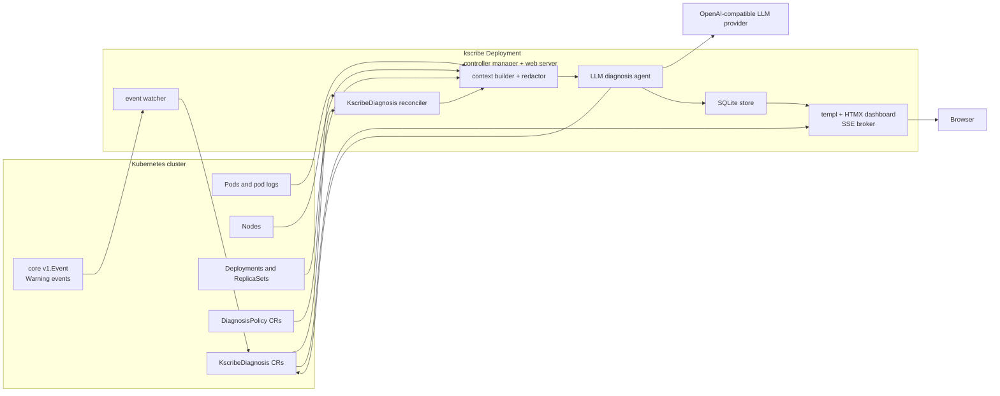
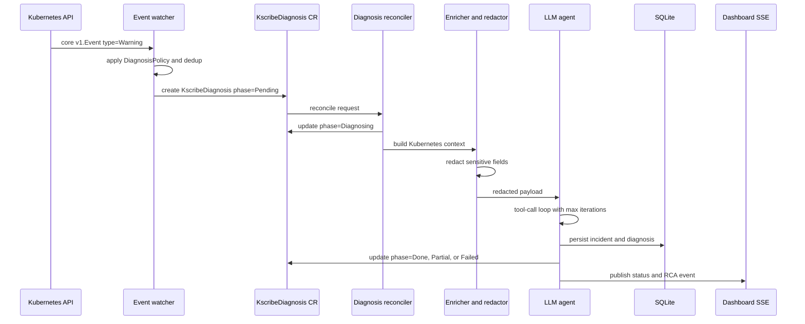
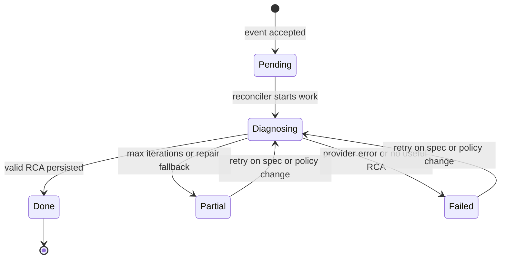

# kscribe Kubernetes Operator MVP


This plan builds `kscribe` as a Kubernetes operator: a single Go controller-manager binary that installs CRDs, watches core Kubernetes `Warning` Events, creates `KscribeDiagnosis` custom resources, reconciles each diagnosis through enrichment and an LLM-assisted RCA loop, persists results in SQLite, and serves a templ + HTMX dashboard. The operator runs as a Kubernetes `Deployment`, while the CRDs and reconcilers define the operator behavior.

The repo currently has no Go implementation files, so the plan starts from scaffold and proceeds through API types, reconciliation, agent logic, UI, and deployment.

## 0. Architecture Diagrams

### Runtime Architecture



### Diagnosis Sequence



### Custom Resource Lifecycle



## 1. Requirements & Constraints

- **REQ-001**: The operator must create one deduplicated `KscribeDiagnosis` custom resource for each accepted core `v1.Event` with `type=Warning`.
- **REQ-002**: `KscribeDiagnosis.status.phase` must represent `Pending`, `Diagnosing`, `Done`, `Partial`, and `Failed`.
- **REQ-003**: `DiagnosisPolicy` must provide namespace-level controls for enablement, event reason filters, LLM model/provider overrides, max iterations, and redaction.
- **REQ-004**: The diagnosis reconciler must enrich accepted events with pod logs, related events, node conditions, and deployment/replicaset context when available.
- **REQ-005**: RCA output must persist to SQLite and mirror status back to the `KscribeDiagnosis` status subresource.
- **REQ-006**: The dashboard must list diagnoses and stream per-diagnosis status/RCA updates over SSE using templ + HTMX.
- **SEC-001**: Event messages, pod logs, labels, annotations, deployment metadata, and custom-resource payloads must be redacted before any LLM request.
- **SEC-002**: Persisted diagnoses and CR status must record `llmProvider`, `llmModel`, `tokensUsed`, and `promptRedacted`.
- **SEC-003**: Deployment docs must explicitly state that enriched cluster data is sent to the configured LLM provider.
- **CON-001**: Use Cobra for CLI setup and command help.
- **CON-002**: Use `github.com/caarlos0/env/v11` for typed `KSCRIBE_` environment parsing; Cobra flags override env-derived config.
- **CON-003**: Use `github.com/bytedance/sonic` for RCA, tool-call, custom-resource payload, and persisted JSON encode/decode paths; do not use `encoding/json` in application code unless required at a dependency boundary.
- **CON-004**: Use `controller-runtime` and generated CRDs/RBAC via `controller-gen`.
- **CON-005**: MVP supports core `v1.Event` only; `events.k8s.io/v1` support is deferred.
- **CON-006**: MVP runs with `replicas: 1` and SQLite on one PVC; multi-replica database coordination is deferred.
- **CON-007**: Metrics-server tools, Slack notifications, PagerDuty notifications, Helm charts, and CRD conversion webhooks are out of scope.

## 2. Implementation Steps

> After completing all tasks in a phase, `git add -u` and commit. No `Co-authored-by:`. Tick `[x]` as each task completes.

### Phase 1: Scaffold CLI And Configuration

**Goal**: Create the Go project skeleton, Cobra entrypoint, and typed configuration layer first so every later component has a stable runtime surface.

- [ ] TASK-001: Create `go.mod` for the `kscribe` module and add initial dependencies for Cobra, caarlos0/env, controller-runtime, Sonic, modernc SQLite, chi, and templ.
- [ ] TASK-002: Create `cmd/kscribe/main.go` with a Cobra root command that starts the future manager and exposes `--config`, `--leader-elect`, `--addr`, and `--operator-namespace` flags.
- [ ] TASK-003: Create `internal/config/config.go` with typed config structs parsed from `KSCRIBE_` environment variables using `github.com/caarlos0/env/v11`.
- [ ] TASK-004: Implement flag-over-env precedence in the Cobra command so explicit flags override env-derived config values.
- [ ] TASK-005: Add startup logging with `log/slog` that includes server address, store path, provider, watch mode, and operator namespace.
- [ ] TASK-006: Add unit tests for config defaults, required values, durations, slices, env parsing, and flag precedence.

**Completion criteria**: `go test ./...` passes and `go run ./cmd/kscribe --help` prints Cobra-generated help with the root command description and required flags.

**git commit**: `git add -u && git add go.mod go.sum cmd internal && git commit -m "feat: scaffold operator CLI"`

**Agent Prompt**:
```text
You are a sub-agent implementing Phase 1 of kscribe-mvp.

Context: kscribe is a new Go Kubernetes operator. This phase creates the initial module, Cobra CLI, typed environment config, and startup logging used by all later phases.

Branch: kscribe-mvp/phase-1  |  Base: main

Tasks:
- TASK-001: Create go.mod for the kscribe module and add initial dependencies for Cobra, caarlos0/env, controller-runtime, Sonic, modernc SQLite, chi, and templ.
- TASK-002: Create cmd/kscribe/main.go with a Cobra root command that starts the future manager and exposes --config, --leader-elect, --addr, and --operator-namespace flags.
- TASK-003: Create internal/config/config.go with typed config structs parsed from KSCRIBE_ environment variables using github.com/caarlos0/env/v11.
- TASK-004: Implement flag-over-env precedence in the Cobra command so explicit flags override env-derived config values.
- TASK-005: Add startup logging with log/slog that includes server address, store path, provider, watch mode, and operator namespace.
- TASK-006: Add unit tests for config defaults, required values, durations, slices, env parsing, and flag precedence.

Key files:
- go.mod — define the module and dependencies.
- cmd/kscribe/main.go — implement the Cobra root command.
- internal/config/config.go — implement typed configuration.
- internal/config/config_test.go — test env parsing and defaults.
- cmd/kscribe/main_test.go — test flag precedence or command construction if practical.

Completion criteria: go test ./... passes and go run ./cmd/kscribe --help prints Cobra-generated help with the root command description and required flags.

When done: git add -u && git add go.mod go.sum cmd internal && git commit -m "feat: scaffold operator CLI" — no Co-authored-by
Write a one-paragraph summary of changes and commit SHA.
Do NOT push, open PRs, or modify PLAN.md.
```

---

### Phase 2: Define Operator APIs And Manifests

**Goal**: Add the Kubernetes API surface before controller logic so reconciliation code can compile against stable `KscribeDiagnosis` and `DiagnosisPolicy` types.

**Depends on**: Phase 1 complete

- [ ] TASK-007: Create `api/v1alpha1/groupversion_info.go` with the kscribe API group and scheme registration.
- [ ] TASK-008: Create `api/v1alpha1/kscribediagnosis_types.go` with spec fields for event reference, policy reference, max iterations, LLM provider, and LLM model.
- [ ] TASK-009: Add `KscribeDiagnosis` status fields for phase, observed generation, root cause, severity, confidence, affected resources, remediation, timeline, conditions, tokens used, LLM provider/model, and prompt redaction.
- [ ] TASK-010: Create `api/v1alpha1/diagnosispolicy_types.go` with spec fields for enabled, reason allowlist/denylist, severity threshold, LLM provider/model, max iterations, and redaction.
- [ ] TASK-011: Add kubebuilder markers for schemas, status subresources, short names, and useful printer columns.
- [ ] TASK-012: Add condition helper functions and tests for `KscribeDiagnosis` status updates.
- [ ] TASK-013: Add `hack/boilerplate.go.txt` and generate deepcopy code, CRDs, and RBAC manifests under `config/crd/bases` and `config/rbac`.

**Completion criteria**: `controller-gen object:headerFile=./hack/boilerplate.go.txt paths=./...` and `controller-gen crd,rbac:roleName=kscribe-manager-role paths=./... output:crd:artifacts:config=config/crd/bases` both succeed, and `go test ./...` passes.

**git commit**: `git add -u && git add api config hack && git commit -m "feat: define operator APIs"`

**Agent Prompt**:
```text
You are a sub-agent implementing Phase 2 of kscribe-mvp.

Context: kscribe is a Go Kubernetes operator. This phase defines its CRDs and generated manifests before reconciliation logic is implemented.

Branch: kscribe-mvp/phase-2  |  Base: kscribe-mvp/phase-1

Tasks:
- TASK-007: Create api/v1alpha1/groupversion_info.go with the kscribe API group and scheme registration.
- TASK-008: Create api/v1alpha1/kscribediagnosis_types.go with spec fields for event reference, policy reference, max iterations, LLM provider, and LLM model.
- TASK-009: Add KscribeDiagnosis status fields for phase, observed generation, root cause, severity, confidence, affected resources, remediation, timeline, conditions, tokens used, LLM provider/model, and prompt redaction.
- TASK-010: Create api/v1alpha1/diagnosispolicy_types.go with spec fields for enabled, reason allowlist/denylist, severity threshold, LLM provider/model, max iterations, and redaction.
- TASK-011: Add kubebuilder markers for schemas, status subresources, short names, and useful printer columns.
- TASK-012: Add condition helper functions and tests for KscribeDiagnosis status updates.
- TASK-013: Add hack/boilerplate.go.txt and generate deepcopy code, CRDs, and RBAC manifests under config/crd/bases and config/rbac.

Key files:
- api/v1alpha1/groupversion_info.go — register the API group.
- api/v1alpha1/kscribediagnosis_types.go — define the diagnosis CRD.
- api/v1alpha1/diagnosispolicy_types.go — define the policy CRD.
- api/v1alpha1/*_test.go — test status helper behavior.
- config/crd/bases/*.yaml — generated CRD manifests.
- config/rbac/*.yaml — generated RBAC manifests.
- hack/boilerplate.go.txt — controller-gen boilerplate header.

Completion criteria: controller-gen object:headerFile=./hack/boilerplate.go.txt paths=./... and controller-gen crd,rbac:roleName=kscribe-manager-role paths=./... output:crd:artifacts:config=config/crd/bases both succeed, and go test ./... passes.

When done: git add -u && git add api config hack && git commit -m "feat: define operator APIs" — no Co-authored-by
Write a one-paragraph summary of changes and commit SHA.
Do NOT push, open PRs, or modify PLAN.md.
```

---

### Phase 3: Implement Store And Core Reconcilers

**Goal**: Build the durable state layer and controller-runtime reconciliation flow that turns Kubernetes warning events into diagnosis custom resources and status transitions.

**Depends on**: Phase 2 complete

- [ ] TASK-014: Create `migrations/0001_init.sql` with `incidents` and `diagnoses` tables keyed by custom resource name/namespace and event UID.
- [ ] TASK-015: Implement `internal/store/sqlite.go` with methods to upsert incidents from CRs, update status, insert diagnoses, list incidents, and fetch incident details.
- [ ] TASK-016: Implement embedded migration startup in `internal/store/migrations.go`.
- [ ] TASK-017: Implement `internal/controller/dedup.go` with TTL dedup keyed by event UID when present, then namespace, involved object kind/name, and reason.
- [ ] TASK-018: Implement `internal/controller/event_watcher.go` for core `v1.Event` so accepted warning events create `KscribeDiagnosis` resources.
- [ ] TASK-019: Implement `internal/controller/diagnosispolicy_controller.go` and policy resolution for namespace policy, default operator-namespace policy, then env defaults.
- [ ] TASK-020: Implement `internal/controller/kscribediagnosis_controller.go` with status transitions from `Pending` to `Diagnosing`, `Done`, `Partial`, or `Failed`.
- [ ] TASK-021: Add tests for migrations, store methods, dedup behavior, event filtering, policy selection, and status subresource updates.

**Completion criteria**: `go test ./internal/store ./internal/controller` passes, and fake-client tests prove a warning core `v1.Event` creates one deduplicated `KscribeDiagnosis`.

**git commit**: `git add -u && git add migrations internal/store internal/controller && git commit -m "feat: reconcile diagnosis resources"`

**Agent Prompt**:
```text
You are a sub-agent implementing Phase 3 of kscribe-mvp.

Context: kscribe is a Kubernetes operator. This phase adds SQLite persistence and the controller-runtime reconcilers that create and update KscribeDiagnosis resources.

Branch: kscribe-mvp/phase-3  |  Base: kscribe-mvp/phase-2

Tasks:
- TASK-014: Create migrations/0001_init.sql with incidents and diagnoses tables keyed by custom resource name/namespace and event UID.
- TASK-015: Implement internal/store/sqlite.go with methods to upsert incidents from CRs, update status, insert diagnoses, list incidents, and fetch incident details.
- TASK-016: Implement embedded migration startup in internal/store/migrations.go.
- TASK-017: Implement internal/controller/dedup.go with TTL dedup keyed by event UID when present, then namespace, involved object kind/name, and reason.
- TASK-018: Implement internal/controller/event_watcher.go for core v1.Event so accepted warning events create KscribeDiagnosis resources.
- TASK-019: Implement internal/controller/diagnosispolicy_controller.go and policy resolution for namespace policy, default operator-namespace policy, then env defaults.
- TASK-020: Implement internal/controller/kscribediagnosis_controller.go with status transitions from Pending to Diagnosing, Done, Partial, or Failed.
- TASK-021: Add tests for migrations, store methods, dedup behavior, event filtering, policy selection, and status subresource updates.

Key files:
- migrations/0001_init.sql — define SQLite schema.
- internal/store/sqlite.go — implement persistence.
- internal/store/migrations.go — embed and run migrations.
- internal/store/sqlite_test.go — test persistence behavior.
- internal/controller/dedup.go — implement duplicate suppression.
- internal/controller/event_watcher.go — convert warning events to CRs.
- internal/controller/diagnosispolicy_controller.go — resolve namespace policy.
- internal/controller/kscribediagnosis_controller.go — reconcile diagnosis status.
- internal/controller/*_test.go — fake-client tests.

Completion criteria: go test ./internal/store ./internal/controller passes, and fake-client tests prove a warning core v1.Event creates one deduplicated KscribeDiagnosis.

When done: git add -u && git add migrations internal/store internal/controller && git commit -m "feat: reconcile diagnosis resources" — no Co-authored-by
Write a one-paragraph summary of changes and commit SHA.
Do NOT push, open PRs, or modify PLAN.md.
```

---

### Phase 4: Implement Enrichment And LLM Diagnosis

**Goal**: Add the Kubernetes context builder, redaction, Sonic-backed RCA schema handling, OpenAI-compatible client, and bounded diagnosis worker that produces useful RCA status.

**Depends on**: Phase 3 complete

- [ ] TASK-022: Implement `internal/enricher/context_builder.go` to collect pod logs, related events, node conditions, deployment status, and replicaset context with partial-failure tolerance.
- [ ] TASK-023: Implement `internal/enricher/redactor.go` to redact secret names/values, bearer tokens, API keys, private keys, passwords, connection strings, basic auth URLs, and common sensitive env-var values.
- [ ] TASK-024: Define `internal/agent/schema.go` with `RCAReport`, `RemediationStep`, and `TimelineEvent` using Sonic marshal/unmarshal tests.
- [ ] TASK-025: Define `internal/agent/llm.go` with a small fakeable `LLMClient` interface.
- [ ] TASK-026: Implement `internal/agent/openai.go` for OpenAI-compatible chat completions and tool calling.
- [ ] TASK-027: Implement `internal/agent/tools.go` with `get_pod_logs`, `get_events`, `describe_node`, and `list_recent_deploys`; unknown tools must return structured tool errors.
- [ ] TASK-028: Implement `internal/agent/diagnosis_agent.go` with max iterations, one Sonic-backed JSON repair attempt, status updates, and persistence hooks.
- [ ] TASK-029: Route diagnosis execution through a bounded worker queue used by the `KscribeDiagnosis` reconciler.
- [ ] TASK-030: Add tests for redaction, partial enrichment, Sonic JSON handling, request construction, unknown tools, and `Done`/`Partial`/`Failed` outcomes.

**Completion criteria**: `go test ./internal/enricher ./internal/agent ./internal/controller` passes, and tests prove redacted payloads are sent to the fake LLM before CR status reaches `Done`.

**git commit**: `git add -u && git add internal/enricher internal/agent && git commit -m "feat: diagnose incidents with LLM"`

**Agent Prompt**:
```text
You are a sub-agent implementing Phase 4 of kscribe-mvp.

Context: kscribe is a Kubernetes operator that creates KscribeDiagnosis resources from warning events. This phase implements enrichment, redaction, Sonic-backed RCA parsing, and the LLM diagnosis loop.

Branch: kscribe-mvp/phase-4  |  Base: kscribe-mvp/phase-3

Tasks:
- TASK-022: Implement internal/enricher/context_builder.go to collect pod logs, related events, node conditions, deployment status, and replicaset context with partial-failure tolerance.
- TASK-023: Implement internal/enricher/redactor.go to redact secret names/values, bearer tokens, API keys, private keys, passwords, connection strings, basic auth URLs, and common sensitive env-var values.
- TASK-024: Define internal/agent/schema.go with RCAReport, RemediationStep, and TimelineEvent using Sonic marshal/unmarshal tests.
- TASK-025: Define internal/agent/llm.go with a small fakeable LLMClient interface.
- TASK-026: Implement internal/agent/openai.go for OpenAI-compatible chat completions and tool calling.
- TASK-027: Implement internal/agent/tools.go with get_pod_logs, get_events, describe_node, and list_recent_deploys; unknown tools must return structured tool errors.
- TASK-028: Implement internal/agent/diagnosis_agent.go with max iterations, one Sonic-backed JSON repair attempt, status updates, and persistence hooks.
- TASK-029: Route diagnosis execution through a bounded worker queue used by the KscribeDiagnosis reconciler.
- TASK-030: Add tests for redaction, partial enrichment, Sonic JSON handling, request construction, unknown tools, and Done/Partial/Failed outcomes.

Key files:
- internal/enricher/context_builder.go — gather Kubernetes context.
- internal/enricher/redactor.go — redact sensitive content.
- internal/enricher/*_test.go — test partial context and redaction.
- internal/agent/schema.go — define RCA structs.
- internal/agent/llm.go — define the provider interface.
- internal/agent/openai.go — implement OpenAI-compatible requests.
- internal/agent/tools.go — implement Kubernetes tool calls.
- internal/agent/diagnosis_agent.go — implement the diagnosis loop.
- internal/agent/*_test.go — test agent behavior.
- internal/controller/kscribediagnosis_controller.go — connect diagnosis worker to reconciliation.

Completion criteria: go test ./internal/enricher ./internal/agent ./internal/controller passes, and tests prove redacted payloads are sent to the fake LLM before CR status reaches Done.

When done: git add -u && git add internal/enricher internal/agent && git commit -m "feat: diagnose incidents with LLM" — no Co-authored-by
Write a one-paragraph summary of changes and commit SHA.
Do NOT push, open PRs, or modify PLAN.md.
```

---

### Phase 5: Add Dashboard, Deployment, And Documentation

**Goal**: Provide the user-facing dashboard and deployable operator manifests after the core operator behavior is testable.

**Depends on**: Phase 4 complete

- [ ] TASK-031: Implement `internal/web/server.go` with chi routes for `/`, `/incidents/{id}`, `/incidents/{id}/stream`, and `/healthz`.
- [ ] TASK-032: Implement `internal/web/broker.go` for per-diagnosis SSE subscribers with publish, subscribe, unsubscribe, and request cancellation handling.
- [ ] TASK-033: Implement templ components under `internal/web/templates` for layout, diagnosis list, detail, timeline, remediation, CR phase, and condition badges.
- [ ] TASK-034: Add HTML and SSE handler tests for `Done`, `Partial`, and `Failed` diagnoses.
- [ ] TASK-035: Add `config/manager` manifests and `deploy/kscribe.yaml` containing CRDs, Namespace, ServiceAccount, ClusterRole, ClusterRoleBinding, PVC, Deployment with `replicas: 1`, Service, and a default `DiagnosisPolicy`.
- [ ] TASK-036: Add secret-based `KSCRIBE_LLM_API_KEY` configuration and CPU/memory requests and limits to the deployment manifest.
- [ ] TASK-037: Add `README.md` with CRD examples, local dev commands, in-cluster deployment steps, LLM data egress notice, core `v1.Event` limitation, and all test commands.
- [ ] TASK-038: Verify generated CRDs, templ generation, build, and dry-run manifest validation.

**Completion criteria**: `go test ./...`, `go run github.com/a-h/templ/cmd/templ@latest generate`, `go build ./cmd/kscribe`, and `kubectl apply --dry-run=client -f deploy/kscribe.yaml` all pass.

**git commit**: `git add -u && git add internal/web config/manager deploy README.md && git commit -m "feat: ship operator dashboard"`

**Agent Prompt**:
```text
You are a sub-agent implementing Phase 5 of kscribe-mvp.

Context: kscribe is a Kubernetes operator that diagnoses warning events into KscribeDiagnosis resources. This phase adds the dashboard, deployable manifests, and documentation needed to run the MVP.

Branch: kscribe-mvp/phase-5  |  Base: kscribe-mvp/phase-4

Tasks:
- TASK-031: Implement internal/web/server.go with chi routes for /, /incidents/{id}, /incidents/{id}/stream, and /healthz.
- TASK-032: Implement internal/web/broker.go for per-diagnosis SSE subscribers with publish, subscribe, unsubscribe, and request cancellation handling.
- TASK-033: Implement templ components under internal/web/templates for layout, diagnosis list, detail, timeline, remediation, CR phase, and condition badges.
- TASK-034: Add HTML and SSE handler tests for Done, Partial, and Failed diagnoses.
- TASK-035: Add config/manager manifests and deploy/kscribe.yaml containing CRDs, Namespace, ServiceAccount, ClusterRole, ClusterRoleBinding, PVC, Deployment with replicas: 1, Service, and a default DiagnosisPolicy.
- TASK-036: Add secret-based KSCRIBE_LLM_API_KEY configuration and CPU/memory requests and limits to the deployment manifest.
- TASK-037: Add README.md with CRD examples, local dev commands, in-cluster deployment steps, LLM data egress notice, core v1.Event limitation, and all test commands.
- TASK-038: Verify generated CRDs, templ generation, build, and dry-run manifest validation.

Key files:
- internal/web/server.go — create HTTP routes.
- internal/web/broker.go — implement SSE broker.
- internal/web/handlers.go — render dashboard pages.
- internal/web/templates/*.templ — implement templ UI.
- internal/web/*_test.go — test routes and SSE.
- config/manager/*.yaml — define manager manifests.
- deploy/kscribe.yaml — provide single-file deployment.
- README.md — document usage and limitations.

Completion criteria: go test ./..., go run github.com/a-h/templ/cmd/templ@latest generate, go build ./cmd/kscribe, and kubectl apply --dry-run=client -f deploy/kscribe.yaml all pass.

When done: git add -u && git add internal/web config/manager deploy README.md && git commit -m "feat: ship operator dashboard" — no Co-authored-by
Write a one-paragraph summary of changes and commit SHA.
Do NOT push, open PRs, or modify PLAN.md.
```

---

## 3. Testing

- [ ] TEST-001: Run `go test ./...` to verify all unit and integration tests.
- [ ] TEST-002: Run `go run ./cmd/kscribe --help` to verify Cobra help output.
- [ ] TEST-003: Run `controller-gen object:headerFile=./hack/boilerplate.go.txt paths=./...` to verify generated deepcopy code.
- [ ] TEST-004: Run `controller-gen crd,rbac:roleName=kscribe-manager-role paths=./... output:crd:artifacts:config=config/crd/bases` to verify CRD and RBAC generation.
- [ ] TEST-005: Run `go run github.com/a-h/templ/cmd/templ@latest generate` to verify templ generation.
- [ ] TEST-006: Run `go build ./cmd/kscribe` to verify the operator binary builds.
- [ ] TEST-007: Run `kubectl apply --dry-run=client -f deploy/kscribe.yaml` to verify deployment manifest shape.
- [ ] TEST-008: Run fake-client controller tests proving a core `v1.Event` warning creates one deduplicated `KscribeDiagnosis`.
- [ ] TEST-009: Run redaction tests proving sensitive payload samples are removed before LLM calls.
- [ ] TEST-010: Run agent tests proving `Done`, `Partial`, and `Failed` outcomes update SQLite and CR status consistently.

## 4. Risks & Assumptions

- **RISK-001**: CRD scope can sprawl if too many policy knobs are added early — mitigation: keep only `KscribeDiagnosis` and `DiagnosisPolicy` in MVP and defer conversion webhooks.
- **RISK-002**: SQLite with multiple replicas would create storage and locking ambiguity — mitigation: deploy `replicas: 1` for MVP and defer multi-replica database design.
- **RISK-003**: LLM prompts may leak sensitive cluster data — mitigation: make redaction a required pre-LLM step with tests and document provider data egress.
- **RISK-004**: Event API compatibility can become confusing across Kubernetes versions — mitigation: explicitly support core `v1.Event` only in MVP and document `events.k8s.io/v1` as deferred.
- **RISK-005**: Generated code may require `encoding/json` indirectly through Kubernetes dependencies — mitigation: ban `encoding/json` only in application encode/decode paths, while allowing dependency boundaries.
- **ASSUMPTION-001**: The current branch before planning was `main`.
- **ASSUMPTION-002**: No Go implementation exists yet; `find . -type f -name "*.go"` returned no files.
- **ASSUMPTION-003**: `docs/kscribe-mvp` is the intended feature directory because the user supplied `docs/kscribe-mvp/PLAN.md`.
- **ASSUMPTION-004**: The operator should remain a single binary and single Kubernetes Deployment even though it owns CRDs.
- **ASSUMPTION-005**: OpenAI-compatible LLM support is sufficient for MVP; Anthropic and Ollama are deferred.
